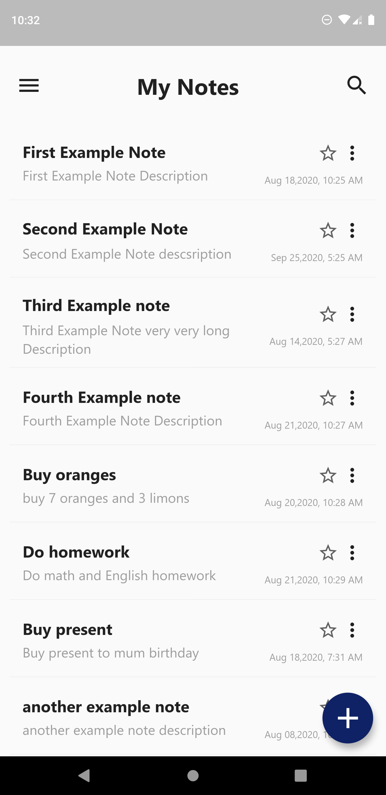
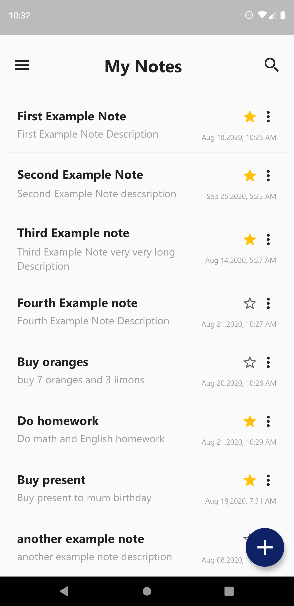
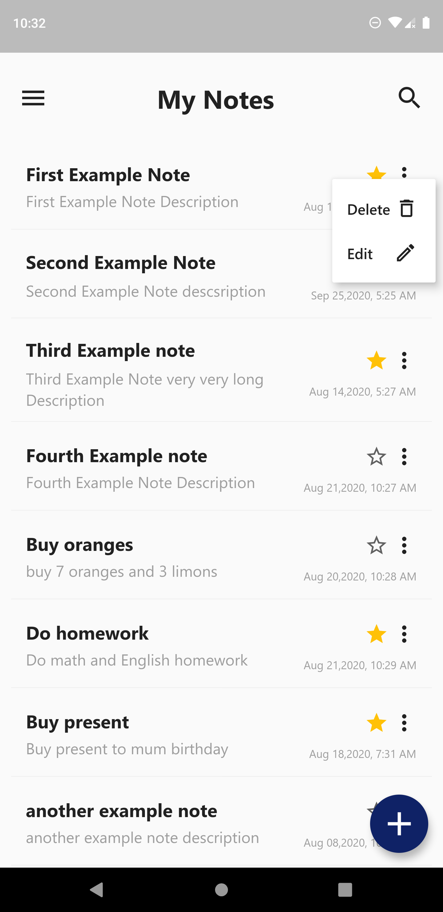
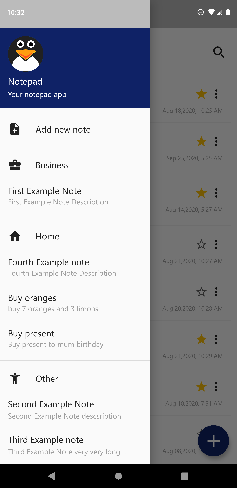
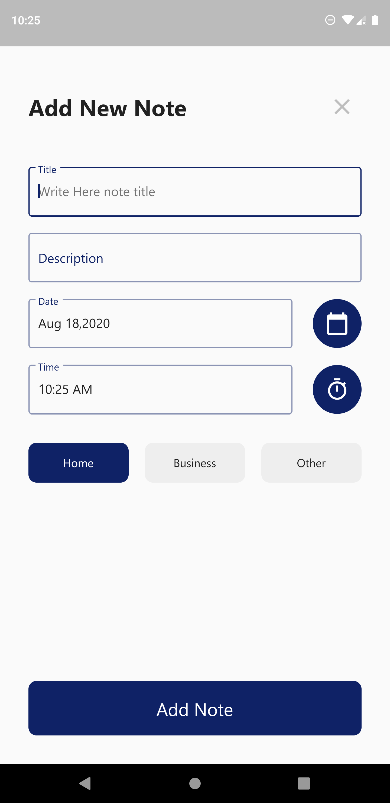
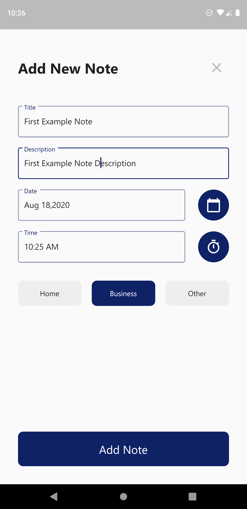
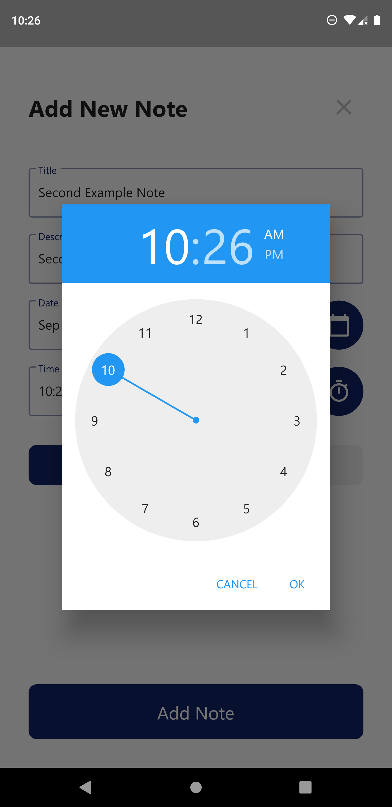
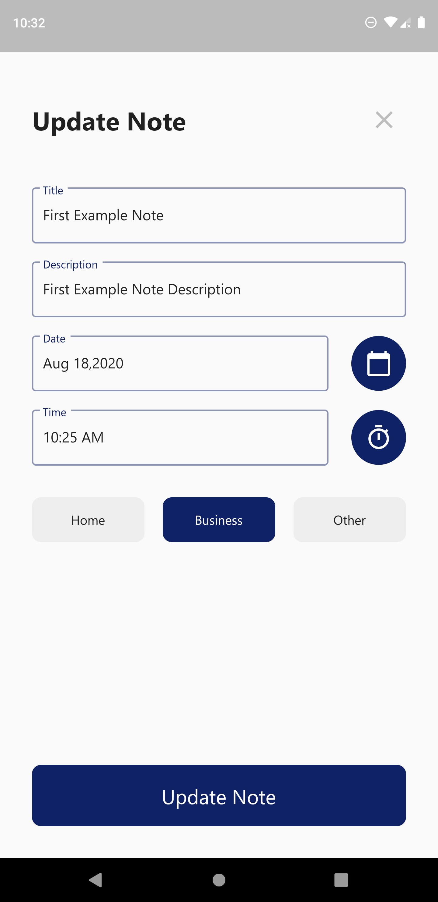
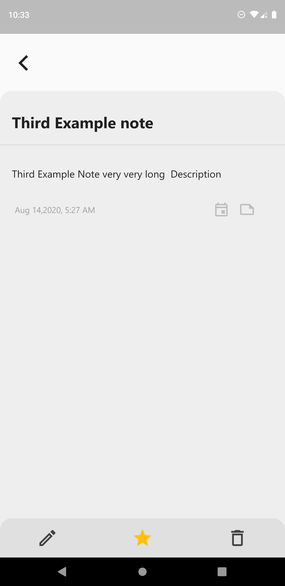

# Notepad App
# Notepad App in Flutter

A new Flutter application.
#### Notepad App usign flutter Sqflite library

## Getting Started
This project is a starting point for a Flutter application.

#### Used features:
- flutter material design library
- flutter outline material icons library [link](https://pub.dev/packages/outline_material_icons)
- flutter sqflite database library [link](https://pub.dev/packages/sqflite)
- flutter intl library [link](https://pub.dev/packages/intl)
- flutter path library [link](https://pub.dev/packages/path)
- flutter cupertino icons library [link](https://pub.dev/packages/cupertino_icons)

A few resources to get you started if this is your first Flutter project:
- [Lab: Write your first Flutter app](https://flutter.dev/docs/get-started/codelab)
- [Cookbook: Useful Flutter samples](https://flutter.dev/docs/cookbook)

For help getting started with Flutter, view our
[online documentation](https://flutter.dev/docs), which offers tutorials,
samples, guidance on mobile development, and a full API reference.

#### Used technology
- async tasks
- build listview with builder method
- use maps and lists
- use navigator with routes named component
- custom classes and widgets
- save, update, delete, get all, get by id methods in sqflite
- use drawer component
- use text fields with text editing controller
- custom buttons and text fields
- use popup dropdown menu
- use date and time picker

## Screenshots :

## Thanks for reading. Don't forget to star my project